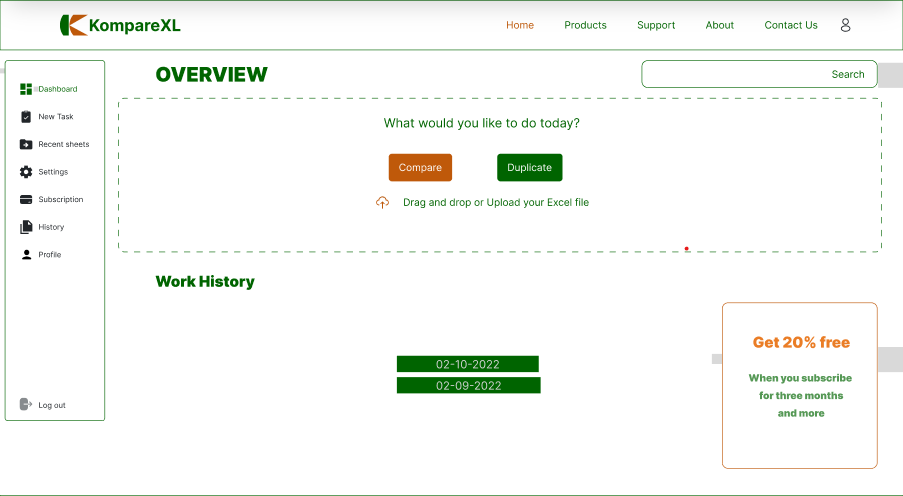

# Team-Cat2-Excel-Comp

A web application that allow users compare the content of excel files.


<!-- ## Table of contents

- [Product Name](#product-name)
  - [Sketch Demo](#sketch-demo)
- [Technology Used](#technology-used)
  - [Design Tools](#design-tools)
  - [Tech Stack](#tech-stack)
- [Why this Product?](#why-this-product)
- [Features](#features)
- [Links](#🔗-links)
- [Documentation](#documentation)
- [Development Environment](#development-environment-local)
  - [System Requirements](#system-requirements)
  - [Check if Node is installed](#to-check-if-node-is-installed)
  - [Getting Started With Local Development](#getting-started-with-local-development)
- [Authors](#authors)
- [Acknowledgment](#acknowledgement)
-[License](#license) -->

<details>
    <summary><b>Table of Contents</b></summary>
    <ul>
        <li><a href="#product-name">Product Name</a>
            <ul>
                <li><a href="#sketch-demo">Sketch Demo</a></li>
            </ul>
        </li>
    </ul>
    <ul>
        <li><a href="#technology-used">Technology Used</a>
            <ul>
                <li><a href="#design-tools">Design Tools</a></li>
                <li><a href="#tech-stack">Tech Stack</a></li>
            </ul>
        </li>
    </ul>
    <ul>
        <li><a href="#why-this-product">Why this Product?</a></li>
    </ul>
    <ul>
        <li><a href="#features">Features</a></li>
    </ul>
    <ul>
        <li><a href="#🔗-links">Links</a></li>
    </ul>
    <ul>
        <li><a href="#documentation">Documentation</a></li>
    </ul>
    <ul>
        <li><a href="#development-environment-local">Development Environment</a>
            <ul>
                <li><a href="#system-requirements">System Requirements</a></li>
                <li><a href="#to-check-if-node-is-installed">Check if Node is installed</a></li>
                <li><a href="#getting-started-with-local-development">Getting Started With Local Development</a></li>
            </ul>
        </li>
    </ul>
    <ul>
        <li><a href="#authors">Authors</a></li>
    </ul>
    <ul>
        <li><a href="#acknowledgement">Acknowledgement</a></li>
    </ul>
    <ul>
        <li><a href="#license">License</a></li>
    </ul>
</details>

## Product Name
KompareXL

### Sketch Demo 


## Technology Used

### Design Tools


### Tech Stack

**Client:** <br>     

**Server:** <br>   

**Database** <br> 

**Authentication** <br>  

**Project Management** <br> 


## Why this Product?

Users, especially ones working with excel files containing large amounts of data won't be able to check for duplicates and differences accurately. So, we created `KompareXL`, a simple user friendly web application that would enable users work faster and efficiently to speed productivity.
It allow users to:

* Upload csv / excel files 
* Compare the content of the files
* Make changes and perform series of other tasks like highlights, removal, etc.
* Save progress for later
* Export / download results.

View [Documentation](#documentation) for more.

## Features

- Upload csv / excel files
- Highlight duplicates in files
- Remove duplicates
- Return a single file or two files (i.e result and/or original)
- Save file (option save progress for later) 
- Download file

## 🔗 Links

- [Figma](https://www.figma.com/file/DehtcTUqJCW8suCU0PefW6/TeamCat2-LoFi-and-HiFi-Design?node-id=2%3A1224)
- [Data Schema](https://docs.google.com/document/d/11itXgR0bVN7G6St82LZl_3ehv8RApO0uYZAhCXEpB-M/edit)
- [Live Site](https://komparexl-17bc.onrender.com)


## Documentation

View [Documentation](https://docs.google.com/document/d/16jbtZdRiUadZQ8W-qdfYqybhE10SQpzUyC1eQFPA1ew/edit?usp=sharing) here


## Development Environment (Local)

### System Requirements

Before you begin, ensure you have the following installed:

- Node.js v16 or above
- An IDE
- Git

### To check if node is installed

```bash
  node --version
```
Install the latest version [here](https://nodejs.org/en/)

### Getting Started With Local Development

Follow these simple instructions to set up a local development environment.

1. Clone the repository

```bash
  git clone https://github.com/zuri-training/Team-Cat2-excel_comp.git
```

2. Go to the project directory

```bash
  cd Team-Cat2-excel_comp
```
3. Install dependencies 

```bash
  npm install
```

4. Start the server

```bash
  npm run start
```


## Authors

- Team members [@Team-Cat2](https://github.com/orgs/zuri-training/teams/team-cat2/members)

## Acknowledgement

A huge thank you to the Zuri team and I4G for giving us the priviledge to take some steps higher is advancing our career in the tech space. Thank you to the mentors, we appreciate you all. 

## License

[](https://choosealicense.com/licenses/mit/)

